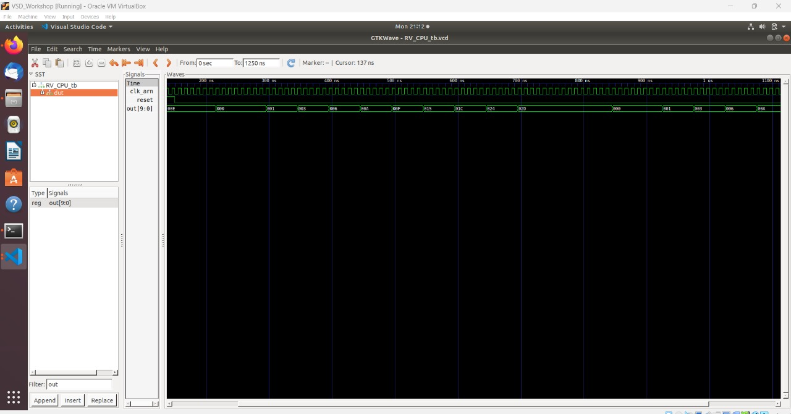

# ASIC Design Class

# First Session: Compiling a C program using GCC and RISC-V

## 1. Compiled C code over GCC (O1)
**1.1** A simple C code which calculates the sum of numbers upto 5 is run over GCC in the manner discussed. 
 
 Firstly, a text editor is used to write the code as shown below. We use leafpad.

 <br>

In the screenshot posted above, leafpad is summoned using the **leafpad sum1ton.c** command. Here, **sum1ton.c** is the C program file which contains our code. Therefore, write the code in it. And save it, obviously.

**1.2** Going ahead, compile the written C code in the manner shown below.

 <br>

**gcc sum1ton.c** command compiles the C program and an executable is created. 

Also shown is the process to run the executable **a.out** which is the default executable generated by the gcc. The output can be made out, which is 15. **We will call it O1**.

## 2. Compiled C code over RISCV compiler.

Akin to what was done in the previous section, similar code is run using RISCV compiler. Two compiler flags O1 and Ofast are used. 

**2.1** Same C program is used and displayed using the *cat sum1ton.c* command. As shown in the image below, the command to compile using O1 compiler flag is shown.


 <br>

The following command does the compilation:

```
riscv64-unknown-elf-gcc -O1 -mabi=lp64 -march=rv64i -o sum1ton.o sum1ton.c
```

**2.2** The next thing to do is to create object file. This file has the compiler's output. We can infer the number of instructions in the manner explained.

The following command can be used to observe the assembly code generated by the program:

```
riscv64-unknown-elf-objdump -d sum1ton.o | less
```

After navigating to the */main* section, one can calculate the number of instructions using O1 in the compile command.

 <br>

**One can infer the number of instructions to be 11** in this case, starting from 0x10184 to 0x101ac. 

**Note:** When the assembly instructions are displayed, *main* function can be accessed by typing /main on the command line argument. One can then go ahead and analyse the number of instructions by simply calculating or by analysing the Hexadecimal values of the base addresses of main function and the next succeeding function.

**2.3** Using Ofast compiler flag.

The exact steps of O1 flag are repeated barring the command. 

 <br>

The following command does the compilation again, but using Ofast, this time:

```
riscv64-unknown-elf-gcc -Ofast -mabi=lp64 -march=rv64i -o sum1ton.o sum1ton.c
```
Similarly, the object file is created using the same command which was used for O1 flag. 

Navigate to the *main* section again by typing */main* in the command line argument. **After we infer the number of instructions, we can see they are 11 of them**. 

**Note:** Again, you can also calculate the number of instructions by referring the base address of the main function section and base address of the next occuring section. Refer to the image below.

 <br>

**The number of instructions here come up to be 11 again.**


The primary reason why this might occur is because the algorithm complexity is not high. Therefore, the underlying algorithm might not benefit from using Ofast, which seems to be the case here.

# SECOND SESSION:  Program output and Debugging 

## The objective is to confirm the output of the program is same as the previous case and to debug the object dump file.

## 1. Program Output
1.1 Compile the program again using riscv gcc using the command: 

```
riscv64-unknown-elf-gcc -Ofast -mabi=lp64 -march=rv64i -o sum1ton.o sum1ton.c
```
1.2 Following command runs the object file and displays the result: 
```
spike pk sum1ton.o
```
The output is as follows: 
 <br>
**The output can be inferred from the snapshot above. It is 15, which is equal to the previous cases.**

1.3 Again, using the command
```
riscv-unknown-elf-objdump -d sum1ton.o | less
```
will display the object dump, where all the instructions are listed to analyse and infer.

Snapshot of object dump: 

 <br>

**This will be essential for debugging.**

## 2. DEBUGGING

To debug is to go through every instruction, specified by a memory address, and analyse what the instruction performs.

**2.1** Here, we modify the program counter such that it stops at the memory address of the first instruction of the obj dump file using the command: 
```
spike -d pk sum1ton.o
until pc 0 100b0
```
This will open a debugger. **Also, notice that the memory address of the first instruction is 100b0, inferred through the obj dump snapshot.**

The command will stop the program counter at 100b0, all the intructions will thereon commence only after the user presses the enter button.


**2.2** The intruction correspondong to the first memory address 100b0, is: *lui a0, 0x21*. We will not delve into the deteils of the instruction but our task is to observe whether the instruction worked or it did not i.e was it able to run the lui command.

For that, we will observe the contents of register a0, before running the operation. Have a look at the snapshot below.

 <br>

It can be seen using the command:

```
reg 0 a0
```
that the contents of the register a0 before the instruction was 0x......01, later it was 0x....21000. Use the same command to assess the contents of the register again after the instruction was run using the "Enter" key.

Clearly, the value stored in a0 was appended as per the instruction.

**2.3** Moving on, similar steps are followed for the next instruction. 

From the object dump file, the next instruction is *addi sp,sp, -16*. sp is an appreviation for Stack Pointer which is also a register. Run the command:

```
reg 0 sp
```
Take reference from the snapshot obtained.

 <br>

The value before the instruction is 0x0000003ffffffb50. Once we press enter, we can observe that the value is appended by -16. 

The new value stored in the register sp can accesses using the same command as above, which is 0x0000003ffffffb40.

**Note:**
1. *lui* and *addi* are immediate instructions. *lui* stands for Left Upper Immediate, where 'Upper' refers to the first 16 bits. 
2. *addi* adds the content of the source register and immediate and goes on to store the result in the destination register. 


# Third Session 

# 1. Identifying Instruction Types

## As the activity suggests, intruction types are being indentified for the instructions provided. The 32bit code is identified to do so. Each instruction type has it's own instruction format. 


**What are instruction formats in RISCV?** 

Instruction formats can be considered as a 'contract' betwwen the assembly language and the hardware where, if the assembly language 'demands' to execute the instruction, the hardware knows exactly what to do with it. Therefore, there exists certain instructions and their respective format for the hardware to understand. They are made up of series of 0s and 1s depending upon their format, which includes the type of operation, location of data, etc.

There exists 6 types of instruction formats in RISCV.

* R type

    + 'R' here stands for register. 
    + This type inculcates all arithmetic and logical operations.
    +  They are used for operations that involve 3 registers.
    +  The format of R-type instructions is consistent and includes fields for specifying two source registers, one destination register, a function code to specify the operation, and an opcode.
    +  Examples: ADD, SUB, OR, XOR, etc.
    +  The instruction format is as follows: 
  
   <br>
    + funct7 (7 bits): Function code for additional instruction differentiation.
    + rs2 (5 bits): Second source register.
    + rs1 (5 bits): First source register.
    + funct3 (3 bits): Function code for primary instruction differentiation.
    + rd (5 bits): Destination register.
    + opcode (7 bits): Basic operation code for R-type instructions (0110011 for integer operations).
* I type

    + I-type instructions in the RISC-V architecture are used for operations that involve an immediate value along with one or two registers.
    +  These instructions typically perform operations such as arithmetic with immediate values, load operations, and certain branch instructions.
    +  The format of I-type instructions includes fields for a source register, destination register, an immediate value, a function code, and an opcode.
    +  The instruction format is as follows:
  
   <br>
    + immediate (12 bits): Immediate value used for operations.
    + rs1 (5 bits): Source register.
    + funct3 (3 bits): Function code for instruction differentiation.
    + rd (5 bits): Destination register.
    + opcode (7 bits): Basic operation code for I-type instructions.
  
* S Type 
  
    + S-type instructions in the RISC-V architecture are used for store operations, where data is stored from a register into memory.
   + The format of S-type instructions includes fields for two source registers, an immediate value that determines the memory offset, a function code, and an opcode.
   +  The format is as follows: 

   <br>
    + imm[11:5] (7 bits): Upper 7 bits of the immediate value.
    + rs2 (5 bits): Second source register (contains the data to be stored).
    + rs1 (5 bits): First source register (base address register).
    + funct3 (3 bits): Function code for instruction differentiation.
    + imm[4:0] (5 bits): Lower 5 bits of the immediate value.
    + opcode (7 bits): Basic operation code for S-type instructions.

* B Type

    + B-type instructions in the RISC-V architecture are used for conditional branch operations.
    +  These instructions are designed to alter the flow of execution based on comparisons between two registers. 
    +  The format of B-type instructions includes fields for two source registers, an immediate value that determines the branch offset, a function code, and an opcode.
    +  Following is the instruction format:
    
      <br>
    + imm[12] (1 bit): The 12th bit of the immediate value.
    + imm[10:5] (6 bits): The 10th to 5th bits of the immediate value.
    + rs2 (5 bits): Second source register.
    + rs1 (5 bits): First source register.
    + funct3 (3 bits): Function code for instruction differentiation.
    + imm[4:1] (4 bits): The 4th to 1st bits of the immediate value.
    + imm[11] (1 bit): The 11th bit of the immediate value.
    + opcode (7 bits): Basic operation code for B-type instructions

* U Type

    + U-type instructions in the RISC-V architecture are used for operations involving large immediate values, typically for loading upper immediate values or computing addresses.
    +  The format of U-type instructions includes fields for a destination register, a large immediate value, and an opcode.
    +  The instruction format is as follows:
  
      <br>
    + immediate[31:12] (20 bits): The upper 20 bits of the immediate value.
    + rd (5 bits): Destination register.
    + opcode (7 bits): Operation code for U-type instructions.
    + The immediate value is stored in the upper 20 bits of a 32-bit word, with the lower 12 bits set to zero when used in calculations.

* J type
    + J-type instructions in the RISC-V architecture are used for jump operations, allowing for altering the program control flow by jumping to a specified address.
    + These instructions are typically used for unconditional jumps, like calling functions or implementing loops.
    + Following is the instruction format: 
     
     <br>
    + imm[20] (1 bit): The 20th bit of the immediate value.
    + imm[10:1] (10 bits): The 10th to 1st bits of the immediate value.
    + imm[11] (1 bit): The 11th bit of the immediate value.
    + imm[19:12] (8 bits): The 19th to 12th bits of the immediate value.
    + rd (5 bits): Destination register where the return address is stored.
    + opcode (7 bits): Operation code for J-type instructions.
   
  
  ## Decoding each instruction type provided: 

   1. ``` ADD r1, r2, r3 ```
  
        + Opcode for ADD = 0110011
        + rd = r1 = 00001
        + rs1 = r2 = 00010
        + rs2 = r3 = 00110
        + func3 = 000
        + func7 = 0000000
        + **R Type**
        + 32 Bit Instruction: 0000000_00110_00010_000_00001_0110011
  
   2. ``` SUB r3, r1, r2 ``` 
        + Opcode for SUB = 0110011
        + rd = r3 = 00110
        + rs1 = r1 = 00001
        + rs2 = r2 = 00010
        + func3 = 000
        + func7 = 0100000
        + **R Type**
        + 32 Bit Instruction: 0100000_00010_00001_000_00110_0110011
         
   3. ``` AND r2, r1, r3 ```
        + Opcode for AND = 0110011
        + rd = r2 = 00010
        + rs1 = r1 = 00001
        + rs2 = r3 = 00011
        + func3 = 111
        + func7 = 0000000
        + **R Type**
        + 32 Bit Instruction: 0000000_00011_00001_111_00010_0110011
         
    4. ``` OR r8, r2, r5 ```
        + Opcode for OR = 0110011
        + rd = r8 = 01000
        + rs1 = r2 = 00010
        + rs2 = r5 = 00101
        + func3 = 110
        + func7 = 0000000 
        + **R Type**
        + 32 Bit Instruction: 0000000_00101_00010_110_01000_0110011
    5. ``` XOR r8, r1, r4 ```
        + Opcode for XOR = 0110011
        + rd = r8 = 01000
        + rs1 = r1 = 00001
        + rs2 = r4 = 00100
        + func3 = 100
        + func7 = 0000000  
        + **R Type**      
        + 32 Bit Instruction: 0000000_00100_00001_100_01000_0110011
    6. ``` SLT r10, r2, r4 ```
  
        + Opcode for SLT  = 0110011
        + rd = r10 = 01100
        + rs1 = r2 = 00010
        + rs2 = r4 = 00100
        + func3 = 010
        + func7 = 0000000
        + **R Type**
        + 32 Bit Instruction: 0000000_00100_00010_010_01100_0110011
  
   4. ``` ADDI r12, r3, 5 ``` 
        + Opcode for ADDI = 0010011
        + rd = r12 = 01100
        + rs1 = r3 = 00110
        + imm[11:0] = 5 = 000000000101
        + func3 = 000
        + **I Type**
        + 32 Bit Instruction: 000000000101_00001_000_00110_0010011
         
   5. ``` SW r3, r1, 4 ```
        + Opcode for SW = 0100011
        + rs2 = r3 = 00100
        + rs1 = r1 = 00001
        + func3 = 010
        + imm[11:0] = 4 = 000000000100
        + **S Type**
        + 32 Bit Instruction: 0000000_00100_00001_010_0100_0100011
    6. ``` SRL r16, r11, r2 ```
        + Opcode for SRL = 0110011
        + rd = r16 = 10000
        + rs1 = r11 = 01011
        + rs2 = r2 = 00010
        + func3 = 101
        + func7 = 0000000 
        + **R Type**
        + 32 Bit Instruction: 0000000_00010_01011_101_10000_0110011
    7.  ``` BNE r0, r1 , 20 ```
        + Opcode for BNE = 1100011
        
        + rs1 = r0 = 00000
        + rs2 = r1 = 00001
        + func3 = 001
        + imm[12:1] = 20 = 000000010100
        + **B Type**   
        + 32 Bit Instruction: 0_000001_00001_00000_001_1010_0_1100011
    8.  ``` BEQ r0, r0, 15 ```
        + Opcode for BEQ = 1100011
        + rs1 = r0 = 00000
        + rs2 = r0 = 00000
        + Imm[12:1] = 15 = 000000001111
        + func3 = 000
        + **B Type**  
        + 32 Bit Instruction: 0_000000_00000_00000_000_1111_0_1100011
    9.  ``` LW r13, r11, 2 ```
        + Opcode for LW = 0000011
        + rd = r13 = 01101
        + rs1 = r11 = 01011     
        + imm[11:0] = 000000000010
        + func3 = 010
        + **I Type**
        + 32 Bit Instruction: 000000000010_01011_010_01101_00001
    10. ``` SLL r15, r11, r2 ```
        + Opcode for SLL = 0110011
        + rd = r15 = 01111
        + rs1 = r11 = 01011
        + rs2 = r2 = 00010
        + func3 = 001
        + func7 = 0000000
        + **R Type**     
        + 32 Bit Instruction: 0000000_00010_01011_001_01111_0110011
    
    Therefore, the instructions have been matched to their corresponding types and their 32 bit layout has been constructed as per their respective format. 

# 2. Running assembly instructions in accordance to a provided Verilog code in a RISCV processor.

There exists variations in the bit pattern of the instructions provided. Firstly, for the provided verilog code and the instructions, following is the Bit pattern and the ISA according to the code.
|Operation	     |        Hardcoded ISA |   Bit Pattern (Hardcoded)
|----------------|----------------------|----------------------------------------------------
|ADD R6, R2, R1	 |	      32'h02208300  |   0000001 00010 00001 000 00110 0000000
|SUB R7, R1, R2	 |	      32'h02209380  |   0000001 00010 00001 001 00111 0000000
|AND R8, R1, R3	 |        32'h0230a400  |   0000001 00011 00001 010 01000 0000000
|OR R9, R2, R5	 |        32'h02513480  |   0000001 00101 00010 011 01001 0000000
|XOR R10, R1, R4 |	      32'h0240c500  |   0000001 00100 00001 100 01010 0000000
|SLT R1, R2, R4	 |	      32'h02415580  |   0000001 00100 00010 101 01011 0000000   
|ADDI R12, R4, 5 |	      32'h00520600  |   000000000101 00100 000 01100 0000000   
|**BEQ** R0, R0, 15	 |	  32'h00f00002  |   0 000000 01111 00000 000 0000 0 0000010
|**SW** R3, R1, 2	 |	  32'h00209181  |   0000000 00010 00001 001 00011 0000001
|LW R13, R1, 2	 |	      32'h00208681  |   000000000010 00001 000 01101 0000001  
|SRL R16, R14, R2|        32'h00271803  |   0000000 00010 01110 001 10000 0000011
|SLL R15, R1, R2 |	      32'h00208783  |   0000000 00010 00001 000 01111 0000011


For the custom instructions provided, 

|Operation	     |        RISCV ISA     |   Bit Pattern (RISCV)
|----------------|----------------------|----------------------------------------------------
|ADD r1, r2, r3  |	      32'h006100B3  |   0000000 00110 00010 000 00001 0110011
|SUB r3, r1, r2	 |	      32'h40208333  |   0100000 00010 00001 000 00110 0110011
|AND r2, r1, r3	 |        32'h0230a400  |   0000000 00011 00001 111 00010 0110011
|OR r8, r2, r5	 |        32'h0030F133  |   0000000 00101 00010 110 01000 0110011
|XOR r8, r1, r4  |	      32'h0040C433  |   0000000 00100 00001 100 01000 0110011
|SLT r10, r2, r4 |	      32'h00412633  |   0000000 00100 00010 010 01100 0110011 
|ADDI r12, r3, 5 |	      32'h00508313  |   000000000101 00001 000 00110 0010011   
|SW r3, r1, 4    |	      32'h00205223  |   0000000 00100 00001 010 0100 0100011
|SRL r16, r11, r2|	      32'h0025D833  |   0000000 00010 01011 101 10000 0110011
|BNE r0, r1, 20	 |	      32'h02101A63  |   0 000001 00001 00000 001 1010 0 1100011  
|LW r13, r11, 2  |        32'h000969A1  |   000000000010 01011 010 01101 00001
|SLL r15, r11, r2|	      32'h002597B3  |   0000000 00010 01011 001 01111 0110011
|BEQ r0, r0, 15  |        32'h00000F63  |   0 000000 00000 00000 000 1111 0 1100011

It is to observe that, although the intruction format which is visible in the bit pattern is same for both RISCV ISA and the Hardcoded ISA. The difference lies in the actual representation of the constituent elements, primarily in **func3, func7 and the opcode**.

 For example, if we consider the opcode for ADD instruction, it is 01100110 for RISCV but according to the hardcoded ISA, it comes out to be 0000000. This is similar for SUB instruction as well. Moreover, for SUB instruction, the func3 is 001 for hardcoded ISA and it is 000 for RISCV ISA. The func7 too varies for ADD, SUB, AND, OR, XOR instructions in the harcoded ISA and the RISCV ISA. In short, 
 1. For R type instructions: func3, func7 and the opcode are different.
 2. For I type instructions: opcode is different. 
 3. For B type instructions: opcode is different.
   
Moving on, the snapshots of the waveform/signals of the custom instructions are attached below. The appropriate signals required for each type of instructions are visible in the snapshot.

1. ADD r1, r2, r3


 <br>  
 
2. SUB r3, r1, r2


 <br> 


3. AND r2, r1, r3


 <br> 

4. OR r8, r2, r5


 <br> 

5. XOR r8, r1, r4


 <br> 

6. SLT r10, r2, r4


 <br> 

7. ADDI r12, r3, 5


 <br> 


8. SW r3, r1, 4


 <br> 

 

9.  BNE r0, r1, 20


 <br> 

10.  BEQ r0, r0, 15


 <br> 

11.  LW r13, r11, 2


 <br> 

12.  SLL r15, r11, r2


  <br> 


# Fourth Session: Executing C Code to Print/Determine Prime Numbers Up to a Certain Limit Using the Sieve of Eratosthenes Algorithm 


In this lab, we are repeating the tasks from the first session, but with a different C code implementation.

# **Sieve of Eratosthenes**

The **Sieve of Eratosthenes** is a well-known algorithm with a predictable pattern of execution that heavily relies on memory access and bitwise operations. It is an ancient algorithm used to find all prime numbers up to a specified integer. It works by iteratively marking the multiples of each prime number starting from 2. The numbers that remain unmarked after all the multiples have been marked are prime. Comparing its performance on different architectures and compilers can reveal how well each handles large-scale, memory-intensive operations, and the efficiency of loop unrolling, bitwise optimizations, and cache utilization. 

**Key Aspects:**

* **Memory Allocation and Access**: The algorithm uses a dynamically allocated boolean array to mark non-prime numbers, which tests memory allocation and access patterns.

* **Bitwise Operations and Loops**: The core of the algorithm involves setting bits (marking non-primes) in a loop, testing how well the compiler optimizes such operations.


* **Time Complexity**: The algorithm is efficient but still requires significant computational effort for large limits (like 1,000,000), making it a good performance benchmark.


## 1. Over GCC

1.1 Refer to the C code saved in file *sieve.c*: 

```
#include <stdio.h>
#include <stdbool.h>
#include <stdlib.h> // Include this header for malloc and free
#include <math.h>

void sieve_of_eratosthenes(int limit) {
    // Allocate memory for the prime array
    bool *prime = (bool *)malloc((limit + 1) * sizeof(bool));
    if (prime == NULL) {
        printf("Memory allocation failed\n");
        return;
    }

    // Initialize all entries as true
    for (int i = 0; i <= limit; i++) {
        prime[i] = true;
    }

    prime[0] = prime[1] = false; // 0 and 1 are not primes

    for (int p = 2; p * p <= limit; p++) {
        if (prime[p]) {
            for (int i = p * p; i <= limit; i += p) {
                prime[i] = false;
            }
        }
    }

    // Print the prime numbers
    printf("Prime numbers up to %d are:\n", limit);
    for (int p = 2; p <= limit; p++) {
        if (prime[p]) {
            printf("%d ", p);
        }
    }
    printf("\n");

    // Free the allocated memory
    free(prime);
}

int main() {
    int limit;

    printf("Enter the limit up to which you want to find prime numbers: ");
    scanf("%d", &limit);

    if (limit<2) {
        printf("There are no prime numbers less than 2. \n");
    }   else {
        sieve_of_eratosthenes(limit);
    }
    return 0;
}
```
1.2 The output snapshot is pasted below: 

 <br>  
 
***sieve_gcc.out*** is the name of the output file 

Note: The commands used are the same as of first session apart from the file names. 


## 2. Over RISCV GCC (O1 and Ofast) 


### 2.1 O1 Compiler Flag

**2.1.1** To compile using O1 compiler flag use the following command: 

``` 
riscv64-unknown-elf-gcc -O1 -mabi=lp64i -march=rv64i -o sieveO1 sieve.c
```

***sieveO1*** is the output file after compiler. This is accessed using the command:

``` 
spike pk sieve01
```


**2.1.2** The output is the same as GCC and the following: 

 <br> 


**2.1.3** To gather information about the number of instructions use the following command: 

```
riscv64-unknown-elf-objdump -d sieveO1
```

Again, navigate to the /main section and calculate the number of instructions as done in session two and the number of instructions can be inferred to be 21.

Refer to the snapshot below: 

 <br> 


### 2.2 Ofast Compiler Flag

**2.2.1** To compile using Ofast compiler flag use the following command: 

```
riscv64-unknown-elf-gcc -Ofast -mabi=lp64 -march=rv64i -o sieveOfast sieve.c
```

***sieveOfast*** is the output file after compilation.

**2.2.2** The output is again, the same as GCC and RISCV-GCC with O1 compiler flag. To access the output file using riscv emulator spike, use the command: 

```
spike pk sieveOfast
```


**2.2.3** Use the same step as above (for O1 flag) to gather information about the number of instructions. 

Refer to the snapshot below: 

 <br> 


The number of instructions are 21 again. 


# Fifth Session: Digital Logic with TL Verilog and Makerchip

## What is TL Verilog? 
**TL-Verilog** is a modern hardware description language designed to simplify and accelerate digital design by reducing the verbosity and complexity commonly associated with traditional hardware languages like Verilog and VHDL. TL-Verilog introduces a novel approach to design, emphasizing transactional-level modeling and making it easier to handle complex pipelined designs. With TL-Verilog, designers can focus more on the behavior of the hardware rather than low-level implementation details, thanks to features like automatic pipeline handling, clean and concise syntax, and built-in support for powerful abstraction mechanisms.

## Makerchip

Makerchip is an online platform and integrated development environment (IDE) designed to facilitate the design and simulation of digital circuits using TL-Verilog and traditional Verilog. It provides an accessible and user-friendly environment where users can write, simulate, and visualize their hardware designs directly in a web browser, without the need for installing any software.


## Developing a **Combinational Logic** for a Simple Calculator in TL Verilog using Makerchip


A basic calculator is implemented using a 4x1 multiplexer. It performs the following primitive calculations: 
   
1. ADD: ```$sum[31:0] = $val1[31:0] + $val2[31:0];```
2. SUB: ``$diff[31:0] = $val1[31:0] - $val2[31:0];``
3. QUOT: ``$quot[31:0] = $val1[31:0] / $val2[31:0];``
4. PROD: `$prod[31:0] = $val1[31:0] * $val2[31:0];`  

The above operations are implemented, as mentioned using a 4x1 MUX. The same can be implemented in TL Verilog using ternary operators. Take a look at the code below to do so: 


```
$out[31:0] = ($sel == 2'b00) ? $sum  :  // If sel is 00, select sum
         ($sel == 2'b01) ? $diff :  // If sel is 01, select diff
         ($sel == 2'b10) ? $prod :  // If sel is 10, select prod
                          $quot;   // If sel is 11, select quot

```

The select signal and the operands for the calculators are chosen at random using the `` $random`` command. 

Have a look at the complete TL Verilog code for reference: 

```
$val1[31:0]  = $rand1[3:0];
   $val2[31:0] = $rand2[3:0];
   
   $sum[31:0] = $val1[31:0] + $val2[31:0];
   $diff[31:0] = $val1[31:0] - $val2[31:0];
   $prod[31:0] = $val1[31:0] * $val2[31:0];
   $quot[31:0] = $val1[31:0] / $val2[31:0];
   
   $sel[1:0] = $rand3[1:0];
    
   
   $out[31:0] = ($sel == 2'b00) ? $sum  :  // If sel is 00, select sum
         ($sel == 2'b01) ? $diff :  // If sel is 01, select diff
         ($sel == 2'b10) ? $prod :  // If sel is 10, select prod
                          $quot;   // If sel is 11, select quot
```

The snapshot of the above activity is attached below:


 <br> 

## Adding **Sequential Logic** to the Calculator 

Sequential Logic is implemented by using a clock signal. The signals produced at the offset of each clock might be of importance/use in the program which might need those values to perform operations on them. Therefore we use the ```>>(integer)$(operand_name)``` operator to access signals from clock signal which we require.

### Free Running Counter 
Firstly, we shall implement a Free Running Counter in TL Verilog using Makerchip.

The following code acts as a simple free running counter with a reset value of 0. The counter adds integer 1 to $num1 at each clock. This is done so in the following manner in TL Verilog: 

``` $num1[31:0] = $reset ? 0 : >>1$num1[31:0] + 1; ```

The value stored in $num1[31:0] is utilized using the operator mentioned above for a working model of a counter.

Refer to the snapshot below for reference: 

 <br> 

### Sequential Calculator 
As mentioned , the introduction of sequential logic will introduce the utilization of values which are obtained from clock cycles which are different from the ones where the operations are performed. This was seen in a simple manner in the previous example of a Free Running Counter as well. 


Moving on, our calculator is now modified to "hold" a value. This is done so, in the hardware, using a Flip-Flop. The value stored in the $out[31:0] is now fed to $val1[31:0] from our calculator example. 

This modification is done in the following manner: 

```$val1[31:0]  = >>1$out[31:0]; ```  

Therefore, the value in the output from the subsequent cycle is fed in as our new input. 

Practicallly speaking, calculators need a reset button as well, this will hold the output @ 0. The reset option is added into the 4x1 multiplexer code in the following manner: 
```
$out[31:0] = $reset ? 0 :($sel == 2'b00) ? $sum  :  // If sel is 00, select sum
         ($sel == 2'b01) ? $diff :  // If sel is 01, select diff
         ($sel == 2'b10) ? $prod :  // If sel is 10, select prod
                          $quot;   // If sel is 11, select quot
```
This can be inferred more clearly in the snapshot below: 

 <br> 

From the snapshot, it can be seen that whenever the reset is HIGH, the output is set to 0. The calculator now performs all of it's regular defined operations, albeit now it has one of it's input taken from the output of the previous cycle. 

## Pipelined Logic 

In Verilog, pipelining is often implemented by designing a series of sequential stages where each stage is a separate module or a block of logic, and the stages are connected through registers. Each stage performs a part of the overall computation, and data moves from one stage to the next on each clock cycle.

### Assigning Counter and Calculator Developed in Previous Steps Into a Pipeline

As mentioned, pipelining is done so as to segregate operations or a block of logic which have some coherence or simply put, are associated with each together. In this example, **we shall put the Counter and the Calculator in a single pipeline and within a single pipeline stage as well.**

To initiate a pipeline, use the command: ``` |cacl ``` and make sure the indentation beyond this right.

To assign a pipelining stage to a set of operations, logic block or a module, use the command: ``` @int ```. This integer value depicts the pipelining stage with respect to the clock cycle. The calculator and the counter both, are added to this ``` |calc ``` pipeline in this following manner: 


```
|calc
      @1
             // Declare and initialize variables
         $reset[31:0] = *reset;

             // Generate random values and perform operations
         $val1[31:0] = >>1$out[31:0];
         $val2[31:0] = $rand2[3:0];

          // Perform arithmetic operations
         $sum[31:0] = $val1[31:0] + $val2[31:0];
         $diff[31:0] = $val1[31:0] - $val2[31:0];
         $prod[31:0] = $val1[31:0] * $val2[31:0];
         $quot[31:0] = $val1[31:0] / $val2[31:0];
         $sel[1:0] = $rand3[1:0];

          // Update num1 and output based on selection

         $num1[31:0] = $reset ? 0 : >>1$num1[31:0] + 1;

         $out[31:0] = $reset ? 0 : ($sel == 2'b00) ? $sum  :  
                        ($sel == 2'b01) ? $diff :  
                        ($sel == 2'b10) ? $prod :  
                                         $quot;   

```
The waveforms and the corresponding figure generated is posted below for reference. 


 <br>

### Cycle Calculator 

The code now is modified to use different stages of the pipeline. The 4x1 MUX is now pushed to the second stage while the following circuit is implemented: 

 <br>

Following is the modified code: 

```
|calc
      @1
             // Declare and initialize variables
         $reset = *reset;

             // Generate random values and perform operations
         $val1[31:0] = >>2$out[31:0];
         $val2[31:0] = $rand2[3:0];

          // Perform arithmetic operations
         $sum[31:0] = $val1[31:0] + $val2[31:0];
         $diff[31:0] = $val1[31:0] - $val2[31:0];
         $prod[31:0] = $val1[31:0] * $val2[31:0];
         $quot[31:0] = $val1[31:0] / $val2[31:0];
         $sel[1:0] = $rand3[1:0];

          // Update num1 and output based on selection

         $num1[31:0] = $reset ? 0 : >>1$num1 + 1;
      @2
         $valid = !$num1;
         $rst_alt = $valid | $reset;
         $out[31:0] = $rst_alt ? 32'b0 : ($sel == 2'b00) ? $sum  :  // If sel is 00, select sum
                        ($sel == 2'b01) ? $diff :  // If sel is 01, select diff
                        ($sel == 2'b10) ? $prod :  // If sel is 10, select prod
                                         $quot;   // If sel is 11, select quot


```
This retiming of the 4x1 MUX to the second clock using ``` @2 ``` is done to ease timings. Functionally speaking, everything else remains the same. Snapshot pasted below for reference: 

 <br>


## Validity 

In TL-Verilog, validity is a key concept used to manage data flow through pipelines. It helps ensure that operations are only performed on valid data and prevents the unnecessary processing of invalid or stale data. This concept is essential in pipelined designs, where operations are spread across multiple clock cycles.

### Cycle Calculator with Validity 


Moving on, some changes have been made according to the circuit below: 

 <br>

The enable signal for the 4x1 MUX has now been 'checked' using a valid signal in the following manner: 

``` $rst_alt = $valid | $num1; ``` This is a when condition now for the calculation to occur. We have therefore introduced a condition onto the operations of our calculator. Only if the condition is valid, will the calculator do it's task. This is encoded in the Multiplexer behaviour as an enable signal.
The multiplexer behaviour is also modified in accordance to this in the following manner: 
``` $out[31:0] = $rst_alt ? 32'b0 : ($sel == 2'b00) ? $sum  :  // If sel is 00, select sum
                        ($sel == 2'b01) ? $diff :  // If sel is 01, select diff
                        ($sel == 2'b10) ? $prod :  // If sel is 10, select prod
                                         $quot;   // If sel is 11, select quot
```

Refer to the snapshot below with waveforms to verify the behaviour:

 <br>

# Sixth Session:  Basic RISC-V CPU Micro-architecture 

The block diagram below vaguely represents the RISC-V CPU along with it's components: 

 <br>

1. **Program Counter**: The Program Counter (PC) is a critical component in a RISC-V CPU (and any CPU in general), responsible for keeping track of the address of the next instruction to be executed. Understanding the role and implementation of the PC is fundamental when designing or working with a RISC-V CPU.
2. **Instruction Fetch**: Instruction fetch is the first stage in the instruction execution cycle of a RISC-V CPU. It involves retrieving the instruction pointed to by the Program Counter (PC) from memory so that it can be decoded and executed in subsequent stages.
3. **Instruction Decode**: Instruction decode is the second stage in the instruction execution cycle of a RISC-V CPU. After an instruction is fetched from memory, it needs to be interpreted, or "decoded," to understand what operation is to be performed and which operands are involved. The decoding process involves breaking down the binary instruction into its constituent fields, such as opcode, source registers, destination registers, and immediate values.
4. **Register File Read**: The read register file is a component that contains a collection of registers used to store data during instruction execution. Instructions typically involve accessing data from these registers, with the instruction indicating which registers to read. The retrieved data is then used as operands for operations carried out by the ALU or other CPU components.
5. **Register File Write**: In a RISC-V CPU, the register file write operation is a critical part of the instruction execution process, particularly during the write-back stage of the pipeline. This is where the results of computations or data from memory are written back to a register in the register file
6. **ALU**: The Arithmetic Logic Unit (ALU) in a RISC-V CPU is a key component responsible for performing arithmetic and logical operations. The ALU receives inputs from the register file or immediate values from instructions and produces results that are either stored back into registers, used for branching decisions, or forwarded to other components like memory.
7. **Data Memory**: n a RISC-V CPU, data memory is a crucial component that stores and retrieves data required during program execution. Data memory is involved in load and store operations, where data is either read from or written to memory.

## Fetch and Decode

### Program Counter
The program counter is implemented according to the condition specified in the lab as follows: 
`` $reset = *reset;
         $pc[31:0] = >>1$reset ? 0 : >>1$pc + 32'd4; 
``
The snapshot containing the waveform is pasted below: 

 <br>

### Instruction Fetch 

The fetch code is shifted to the second cycle ```@1``` and the code is given below: 
```
@1 
         $imem_rd_en = !$reset;
         $imem_rd_addr[M4_IMEM_INDEX_CNT-1:0] = $pc[M4_IMEM_INDEX_CNT+1:2];
         $inst[31:0] = $imem_rd_data[31:0]; 
```
Observe the snapshot for inference purpose.

 <br>

### Instruction Decode

### Instruction Type Decode Logic
The code to decode the instruction type from $instr[6:2] is the following: 
```
$is_i_instr = $instr[6:2] ==? 5'b0000x ||
              $instr[6:2] ==? 5'b001x0 ||
              $instr[6:2] ==? 5'b11001;
                       
         
$is_u_instr = $instr[6:2] ==? 5'b0x101;
         
$is_r_instr =   $instr[6:2] ==? 5'b01011 ||
                $instr[6:2] ==? 5'b011x0 ||
                $instr[6:2] ==? 5'b10100;
         
$is_b_instr = $instr[6:2] ==? 5'b11000;
         
$is_j_instr = $instr[6:2] ==? 5'b11011;
         
$is_s_instr = $instr[6:2] ==? 5'b0100x;
```

The above code checks the instruction type from I,U,R,B,J,S. The snapshot is attached below: 

 <br>

### Instruction Immediate Decode Logic 

Find the code below for immediate decode logic:

```
$imm[31:0] = $is_i_instr ? {{21{$inst[31]}}, $inst[30:20]} :
                      $is_s_instr ? {{21{$inst[31]}}, $inst[30:25], $inst[11:8], $inst[7]} :
                      $is_b_instr ? {{20{$inst[31]}}, $inst[7], $inst[30:25], $inst[11:8], 1'b0} :
                      $is_u_instr ? {$inst[31], $inst[30:20], $inst[19:12], 12'b0} :
                      $is_j_instr ? {{12{$inst[31]}}, $inst[19:12], $inst[20], $inst[30:21], 1'b0} :
                                    32'b0;
```

The snapshot which contains the waveforms is given below: 

 <br>

### Extracting Other Instruction Fields based on Instruction Type

Find the code to infer other sub-instructions in the $inst stream.
```
$rs1_use = $is_r_instr || $is_i_instr || $is_s_instr || $is_b_instr;
         ?$rs1_use
            $rs1[4:0] = $inst[19:15];
         
         $rs2_use = $is_r_instr || $is_s_instr || $is_b_instr;
         ?$rs2_use
            $rs2[4:0] = $inst[24:20];
            
         $funct3_use = $is_r_instr || $is_i_instr || $is_s_instr || $is_b_instr;
         ?$funct3_use
            $funct3[2:0] = $inst[14:12];
            
         $funct7_use = $is_r_instr ;
         ?$funct7_use
            $funct7[6:0] = $inst[31:25];
            
         $rd_use = $is_r_instr || $is_i_instr || $is_u_instr || $is_j_instr;
         ?$rd_use
            $rd[4:0] = $inst[11:7];
         
         $opcode[6:0] = $inst;
```
Refer to the waveform below, which is too big to capture within a single frame: 

 <br>

### Decoding Individual Instruction 

Find the code below to do so: 

```
 $dec_bits [10:0] = {$funct7[5], $funct3, $opcode};
         $is_add = $dec_bits ==? 11'b0_000_0110011;
         $is_addi = $dec_bits ==? 11'bx_000_0010011;
         $is_beq = $dec_bits ==? 11'bx_000_1100011;
         $is_bne = $dec_bits ==? 11'bx_001_1100011;
         $is_blt = $dec_bits ==? 11'bx_100_1100011;
         $is_bge = $dec_bits ==? 11'bx_101_1100011;
         $is_bltu = $dec_bits ==? 11'bx_110_1100011;
         $is_bgeu = $dec_bits ==? 11'bx_111_1100011;
         
         
```
The signals defined for each individual instructions can be seen in the waveform below: 

 <br>

## RISCV Control Logic 

### Register File Read 

Refer to the 2-Read, 1-Write Register File below for reference.

 <br>

The code for register file read is adder to ` @1 ` as follows: 

```
$rf_rd_en1 = $rs1_use;
         $rf_rd_index1[4:0] = $rs1;
         $rf_rd_en2 = $rs2_use;
         $rf_rd_index2[4:0] = $rs2;
         
         $src1_value[31:0] = $rf_rd_data1;
         $src2_value[31:0] = $rf_rd_data2;
```
Where the register output for corresponding ` $rs1 ` and ` $rs2 ` are added in ``` $src1_value[31:0] ``` and ``` $src2_value[31:0]. ```

**NOTE**:  The macro ``` m4+rf(@1, @1) ``` defines the register file that we have used above. This register file is capable of performing two reads in a cycle and based on that, provides the corresponding output in the data lines mentioned. 

### ALU Operations for ADD/ADDI 

As mentioned in the lab, the ALU code is provided below: 

```
$result[31:0] = $is_addi ? $src1_value + $imm :
                $is_add ? $src1_value + $src2_value :
                32'bx ;
```

### Register File Write 

For register file write, we need an overhead logic which enables the write operation. It is embedded in the code below: 

```
 $rf_wr_en = $rd_use;
         $rf_wr_index[4:0] = $rd;
         $rf_wr_data[31:0] = $rd == 0 ? 0 : $result;
```

### Implementing Branch Instructions 

We have the enable signals for each type of instructions coded. These 1 bit signals act as enable signals for implementing the code for branch signals. Find the code below: 

```
$taken_branch = $is_beq ? ($src1_value == $src2_value):
                         $is_bne ? ($src1_value != $src2_value):
                         $is_blt ? (($src1_value < $src2_value)^($src1_value[31] != $src2_value[31])):
                         $is_bge ? (($src1_value >= $src2_value)^($src1_value[31] != $src2_value[31])):
                         $is_bltu ? ($src1_value < $src2_value):
                         $is_bgeu ? ($src1_value >= $src2_value):
                                    1'b0;
         `BOGUS_USE($taken_branch)
         $br_tgt_pc[31:0] = $pc + $imm;
```

### Testbench 

Simple testbench to access the register used in our calculation: 

```
*passed = |cpu/xreg[10]>>5$value == (1+2+3+4+5+6+7+8+9) ;
```
### NOTE 
To incorporate the validity and the use of branch instructions in the program counter, edit the 'pc' code as follows: 

```
$pc[31:0] = >>1$reset ? 1'b0 : >>1$taken_branch ? >>1$br_tgt_pc : >>1$pc + 32'd4;
         
```


The log file snapshot is pasted below: 

 <br>


**The overall diagram now looks as following**:

 <br>

**The overall code is as following**:

```
\m4_TLV_version 1d: tl-x.org
\SV
   // This code can be found in: https://github.com/stevehoover/RISC-V_MYTH_Workshop
   
   m4_include_lib(['https://raw.githubusercontent.com/BalaDhinesh/RISC-V_MYTH_Workshop/master/tlv_lib/risc-v_shell_lib.tlv'])

\SV
   m4_makerchip_module   // (Expanded in Nav-TLV pane.)
\TLV

   // /====================\
   // | Sum 1 to 9 Program |
   // \====================/
   //
   // Program for MYTH Workshop to test RV32I
   // Add 1,2,3,...,9 (in that order).
   //
   // Regs:
   //  r10 (a0): In: 0, Out: final sum
   //  r12 (a2): 10
   //  r13 (a3): 1..10
   //  r14 (a4): Sum
   // 
   // External to function:
   m4_asm(ADD, r10, r0, r0)             // Initialize r10 (a0) to 0.
   // Function:
   m4_asm(ADD, r14, r10, r0)            // Initialize sum register a4 with 0x0
   m4_asm(ADDI, r12, r10, 1010)         // Store count of 10 in register a2.
   m4_asm(ADD, r13, r10, r0)            // Initialize intermediate sum register a3 with 0
   // Loop:
   m4_asm(ADD, r14, r13, r14)           // Incremental addition
   m4_asm(ADDI, r13, r13, 1)            // Increment intermediate register by 1
   m4_asm(BLT, r13, r12, 1111111111000) // If a3 is less than a2, branch to label named <loop>
   m4_asm(ADD, r10, r14, r0)            // Store final result to register a0 so that it can be read by main program
   
   // Optional:
   // m4_asm(JAL, r7, 00000000000000000000) // Done. Jump to itself (infinite loop). (Up to 20-bit signed immediate plus implicit 0 bit (unlike JALR) provides byte address; last immediate bit should also be 0)
   m4_define_hier(['M4_IMEM'], M4_NUM_INSTRS)

   |cpu
      
      
      @0
         $reset = *reset;
         $pc[31:0] = >>1$reset ? 1'b0 : >>1$taken_branch ? >>1$br_tgt_pc : >>1$pc + 32'd4;
         
      @1 
         $imem_rd_en = !$reset;
         $imem_rd_addr[M4_IMEM_INDEX_CNT-1:0] = $pc[M4_IMEM_INDEX_CNT+1:2];
         $inst[31:0] = $imem_rd_data[31:0]; 
         
         $is_i_instr = $inst[6:2] ==? 5'b0000x ||
                       $inst[6:2] ==? 5'b001x0 ||
                       $inst[6:2] ==? 5'b11001;
                       
         
         $is_u_instr = $inst[6:2] ==? 5'b0x101;
         
         $is_r_instr = $inst[6:2] ==? 5'b01011 ||
                       $inst[6:2] ==? 5'b011x0 ||
                       $inst[6:2] ==? 5'b10100;
         
         $is_b_instr = $inst[6:2] ==? 5'b11000;
         
         $is_j_instr = $inst[6:2] ==? 5'b11011;
         
         $is_s_instr = $inst[6:2] ==? 5'b0100x;
         
         
         $imm[31:0] = $is_i_instr ? {{21{$inst[31]}}, $inst[30:20]} :
                      $is_s_instr ? {{21{$inst[31]}}, $inst[30:25], $inst[11:8], $inst[7]} :
                      $is_b_instr ? {{20{$inst[31]}}, $inst[7], $inst[30:25], $inst[11:8], 1'b0} :
                      $is_u_instr ? {$inst[31], $inst[30:20], $inst[19:12], 12'b0} :
                      $is_j_instr ? {{12{$inst[31]}}, $inst[19:12], $inst[20], $inst[30:21], 1'b0} :
                                    32'b0;
         
         $rs1_use = $is_r_instr || $is_i_instr || $is_s_instr || $is_b_instr;
         ?$rs1_use
            $rs1[4:0] = $inst[19:15];
         
         $rs2_use = $is_r_instr || $is_s_instr || $is_b_instr;
         ?$rs2_use
            $rs2[4:0] = $inst[24:20];
            
         $funct3_use = $is_r_instr || $is_i_instr || $is_s_instr || $is_b_instr;
         ?$funct3_use
            $funct3[2:0] = $inst[14:12];
            
         $funct7_use = $is_r_instr ;
         ?$funct7_use
            $funct7[6:0] = $inst[31:25];
            
         $rd_use = $is_r_instr || $is_i_instr || $is_u_instr || $is_j_instr;
         ?$rd_use
            $rd[4:0] = $inst[11:7];
         
         $opcode[6:0] = $inst;
         
         $dec_bits [10:0] = {$funct7[5], $funct3, $opcode};
         
         $is_add = $dec_bits ==? 11'b0_000_0110011;
         $is_addi = $dec_bits ==? 11'bx_000_0010011;
         $is_beq = $dec_bits ==? 11'bx_000_1100011;
         $is_bne = $dec_bits ==? 11'bx_001_1100011;
         $is_blt = $dec_bits ==? 11'bx_100_1100011;
         $is_bge = $dec_bits ==? 11'bx_101_1100011;
         $is_bltu = $dec_bits ==? 11'bx_110_1100011;
         $is_bgeu = $dec_bits ==? 11'bx_111_1100011;
         
         //Register Read 
         $rf_rd_en1 = $rs1_use;
         $rf_rd_index1[4:0] = $rs1;
         $rf_rd_en2 = $rs2_use;
         $rf_rd_index2[4:0] = $rs2;
         
         $src1_value[31:0] = $rf_rd_data1;
         $src2_value[31:0] = $rf_rd_data2;
         
       
         
         //ALU
         $result[31:0] = $is_addi ? $src1_value + $imm :
                         $is_add ? $src1_value + $src2_value :
                         32'bx ;
         
         //Register File Write 
         
         $rf_wr_en = $rd_use;
         $rf_wr_index[4:0] = $rd;
         $rf_wr_data[31:0] = $rd == 0 ? 0 : $result;
         
         //Branch Instructions
         
         $taken_branch = $is_beq ? ($src1_value == $src2_value):
                         $is_bne ? ($src1_value != $src2_value):
                         $is_blt ? (($src1_value < $src2_value)^($src1_value[31] != $src2_value[31])):
                         $is_bge ? (($src1_value >= $src2_value)^($src1_value[31] != $src2_value[31])):
                         $is_bltu ? ($src1_value < $src2_value):
                         $is_bgeu ? ($src1_value >= $src2_value):
                                    1'b0;
         `BOGUS_USE($taken_branch)
         $br_tgt_pc[31:0] = $pc + $imm;
         
         //Testbench
         *passed = |cpu/xreg[10]>>5$value == (1+2+3+4+5+6+7+8+9) ;
      // YOUR CODE HERE
      // ...

      // Note: Because of the magic we are using for visualisation, if visualisation is enabled below,
      //       be sure to avoid having unassigned signals (which you might be using for random inputs)
      //       other than those specifically expected in the labs. You'll get strange errors for these.

   
   // Assert these to end simulation (before Makerchip cycle limit).
   *passed = *cyc_cnt > 40;
   *failed = 1'b0;
   
   // Macro instantiations for:
   //  o instruction memory
   //  o register file
   //  o data memory
   //  o CPU visualization
   |cpu
      m4+imem(@1)    // Args: (read stage)
      m4+rf(@1, @1)  // Args: (read stage, write stage) - if equal, no register bypass is required
      //m4+dmem(@4)    // Args: (read/write stage)

   m4+cpu_viz(@4)    // For visualisation, argument should be at least equal to the last stage of CPU logic. @4 would work for all labs.
\SV
   endmodule
```

The individual labs are commented to better navigate through the code.

# Seventh Session: Complete Pipelined RISC-V CPU Microarchitecture


## Valid Signal

To find valid signals for the program counter to execute and point, introduce a `` $start `` and a new `` $valid `` signal as following:

```
$start = >>1$reset && !$reset;
$valid = $reset ? 1'b0 : ($start || >>3$valid);

```

Moreover, a new valid branch signal is assigned as follows: 

```
$valid_taken_br = $valid && $taken_branch;
```

The next thing to do is to incorporate this into the program counter assignment as follows: 

```
$pc[31:0] = >>1$reset ? 1'b0 : >>3$valid_taken_branch ? >>3$br_tgt_pc : >>1$pc + 32'd4;
```

## Branch Target Path 

The `$valid`, `$valid_load` and `$valid_jump` signals need to be defined and incorporated in the `$valid` signal now in `@1`.

```
$valid = !(>>1$valid_taken_branch || >>2$valid_taken_branch || >>1$valid_load || >>2$valid_load 
                    || >>1$valid_jump || >>2$valid_jump) ;
                    
         $valid_load = $valid && $is_load ;
         $valid_jump = $valid && $is_load;
      


```

Moving on, more instruction signals are added to the code. They are: 

```
$is_load = $dec_bits ==? 11'bx_xxx_0000011;
         $is_sb = $dec_bits ==? 11'bx_000_0100011;
         $is_sh = $dec_bits ==? 11'bx_001_0100011;
         $is_sw = $dec_bits ==? 11'bx_010_0100011;
         $is_slti = $dec_bits ==? 11'bx_010_0010011;
         $is_sltiu = $dec_bits ==? 11'bx_011_0010011;
         $is_xori = $dec_bits ==? 11'bx_100_0010011;
         $is_ori = $dec_bits ==? 11'bx_110_0010011;
         $is_andi = $dec_bits ==? 11'bx_111_0010011;
         $is_slli = $dec_bits ==? 11'b0_001_0010011;
         $is_srli = $dec_bits ==? 11'b0_101_0010011;
         $is_srai = $dec_bits ==? 11'b1_101_0010011;
         $is_sub = $dec_bits ==? 11'b1_000_0110011;
         $is_sll = $dec_bits ==? 11'b0_001_0110011;
         $is_slt = $dec_bits ==? 11'b0_010_0110011;
         $is_sltu = $dec_bits ==? 11'b0_011_0110011;
         $is_xor = $dec_bits ==? 11'b0_100_0110011;
         $is_srl = $dec_bits ==? 11'b0_101_0110011;
         $is_sra = $dec_bits ==? 11'b1_101_0110011;
         $is_or = $dec_bits ==? 11'b0_110_0110011;
         $is_and = $dec_bits ==? 11'b0_111_0110011;
         $is_lui = $dec_bits ==? 11'bx_xxx_0110111;
         $is_auipc = $dec_bits ==? 11'bx_xxx_0010111;
         $is_jal = $dec_bits ==? 11'bx_xxx_1101111;
         $is_jalr = $dec_bits ==? 11'bx_000_1100111;
         $is_jump = $is_jal || $is_jalr ;
```

## Updating Register Read 

Register Read is updated as follows: 

```
$rf_rd_en1 = $rs1_use && >>2$result;
         $rf_rd_index1[4:0] = $rs1;
         $rf_rd_en2 = $rs2_use && >>2$result;
         $rf_rd_index2[4:0] = $rs2;
```
## Data Memory 

```
$dmem_wr_en = $is_s_instr && $valid ;
         $dmem_addr[3:0] = $result[5:2] ;
         $dmem_wr_data[31:0] = $src2_value ;
         $dmem_rd_en = $is_load ;
```

## Load Data

```
$ld_data[31:0] = $dmem_rd_data ;

```

## Adding Instruction Signals and their definitions to $result in ALU 

```
$result[31:0] = $is_addi ? $src1_value + $imm :
              $is_add ? $src1_value + $src2_value :
              $is_andi ? $src1_value & $imm :
              $is_ori  ? $src1_value | $imm :
              $is_xori ? $src1_value ^ $imm :
              $is_slli ? $src1_value << $imm[5:0] :
              $is_srli ? $src1_value >> $imm[5:0] :
              $is_and ? $src1_value & $src2_value :
              $is_or ? $src1_value | $src2_value :
              $is_xor ? $src1_value ^ $src2_value :
              $is_sub ? $src1_value - $src2_value :
              $is_sll ? $src1_value << $src2_value[4:0] :
              $is_srl ? $src1_value >> $src2_value[4:0] :
              $is_sltu ? $src1_value < $src2_value :
              $is_sltiu ? $src1_value < $imm :
              $is_lui ? {$imm[31:12], 12'b0} :
              $is_auipc ? $pc + $imm : 
              $is_jal ? $pc + 32'd4 :
              $is_jalr ? $pc + 32'd4 :
              $is_srai ? {{32{$src1_value[31]}}, $src1_value} >> $imm[4:0] :
              $is_slt ? ($src1_value[31] == $src2_value[31]) ? $sltu_rslt : {31'b0, $src1_value[31]} :
              $is_slti ? ($src1_value[31] == $imm[31]) ? $sltiu_rslt : {31'b0, $src1_value[31]} :
              $is_sra ? {{32{$src1_value[31]}}, $src1_value} >> $src2_value[4:0] :
              $is_load || $is_s_instr ? $src1_value + $imm :
              32'bx ;
      @3
         //Register File Write 
         
         $rf_wr_en = $rd_use && $rd != 5'b0 && $valid || >>2$valid_load;
         $rf_wr_index[4:0] = >>2$valid_load ? >>2$rd : $rd;
         $rf_wr_data[31:0] = >>2$valid_load ? >>2$ld_data :  $result;
         
         //Branch Instructions
         
         $taken_branch = $is_beq ? ($src1_value == $src2_value):
                         $is_bne ? ($src1_value != $src2_value):
                         $is_blt ? (($src1_value < $src2_value)^($src1_value[31] != $src2_value[31])):
                         $is_bge ? (($src1_value >= $src2_value)^($src1_value[31] != $src2_value[31])):
                         $is_bltu ? ($src1_value < $src2_value):
                         $is_bgeu ? ($src1_value >= $src2_value):
                                    1'b0;

```
### Note: Change the MACROS again as follows:

```
|cpu
      m4+imem(@1)    // Args: (read stage)
      m4+rf(@2, @3)  // Args: (read stage, write stage) - if equal, no register bypass is required
      m4+dmem(@4)    // Args: (read/write stage)

   m4+cpu_viz(@4)    // For visualisation, argument should be at least equal to the last stage of CPU logic. @4 would work for all labs.
```


## Final RISCV Diagram

The final diagram comes out to be: 


 <br>


## Final Waveforms
### Waveforms containing *clk_arn* i.e. personalized clock name.
 <br>

### Waveform containig reset signal. 

 <br>

### Waveform containing contents in xreg14 for each cycle.

 <br>

## Note: The final code is uploaded in this repository as *riscv.tlv*.


# Session Eight: Converting riscv.tlv Code to Verilog Code

 We are now converting our TLV code in the file riscv.tlv to verilog code using Python's Sandpiper-SaaS library.

After converting the TLV code to Verilog, we will write a Verilog testbench. We will then compare the waveforms generated from the MakerChip platform with those obtained from the Verilog code output.

Therefore, to do the above task follow the given steps:

## Create a python Virtual Environment

As the name suggests, use the following command to create a virtual environment:

```
python -m venv .venv 

```
## Download sandpiper-saas python module

Use the following command to do so: 

```
pip3 install sandpiper-saas

```

Now once the virtual environment is created and the sandpiper module is installed using the previous commands, use the command below that will undergo conversion:

```
sandpiper-saas -i ./tlv_code/cpu.tlv -o RV_CPU.v --bestsv --noline -p verilog --outdir ./src/module/

```
This command takes our previously written TLV code which is now stored in cpu.tlv for this lab's purpose.


## Testbench & iverilog 


Testbench is written which contains a clock signal of 5ps i.e. 1 GHz. At 25ps we are setting the reset signal to HIGH and after a while we set this LOW. When this state is reached, our CPU starts to perform the tasks which it is supposed to perform. 

Use iverilog which was installed in previous labs to compile this converted TLV code using the testbench we wrote. The following command does that: 

```
iverilog -o output/RV_CPU.out src/module/cpu_tb.v -I src/include -I src/module
```

Note that we have stored our testbench named cpu_tb.v in the module folder. This command will generate an 'out' file.

## Using gtkwave 

gtkwave was installed in the previous labs for the purpose of waveform visualization. The 'out' file which was generated is given as an input to the command line prompt which is as follows: 

```
./RV_CPU.out
gtkwave RV_CPU_tb.vcd
```

## Required Results 

Consider the makerchip waveforms which were generated in the previous lab: 

### Waveforms containing *clk_arn* i.e. personalized clock name.
 <br>

### Waveform containig reset signal. 

 <br>

### Waveform containing contents in xreg14 for each cycle.

 <br>

## GTK Waveform for this lab.

 <br>

Therefore, the final result of 2D is visible in the waveform output produced by gtkwave.

# Session Eight: Installing Required Tools and Using BabySoC 


## Yosys
Firstly, we need to install Yosys. To do that follow the given commands/steps.

1.  Clone the repository to your local PC using:  
    
    `git clone https://github.com/YosysHQ/yosys.git`
    
    
2. Go to the Yosys directory: 
        
    `cd yosys`
    
3.  Further steps: 
    ```
        $ sudo apt install make (If make is not installed) 
       
        $ sudo apt-get install build-essential clang bison flex \
        libreadline-dev gawk tcl-dev libffi-dev git \
        graphviz xdot pkg-config python3 libboost-system-dev \
        libboost-python-dev libboost-filesystem-dev zlib1g-dev
       
        $ make config-gcc
       
        $ make 
       
        $ sudo make install
    ```
    

    Note: The above commands are specified beforehand and the tools above are required for this lab.


## iverilog 


Iverilog is an open-source Verilog simulation and synthesis tool that allows you to compile and simulate Verilog HDL (Hardware Description Language) designs. It's commonly used in digital design and verification to test the functionality of hardware models before implementing them on actual hardware like FPGAs or ASICs.

Use the following command to install: 

`     sudo apt-get install iverilog ` 


## gtkwave

GTKWave is an open-source waveform viewer used to analyze the simulation output of digital circuits, typically generated by simulation tools like Icarus Verilog (Iverilog). It is widely used in hardware design and verification to visualize and debug the behavior of digital systems described in Verilog, VHDL, or other hardware description languages. 

Use the following command to install: 

`  sudo apt install gtkwave ` 

## openSTA

1. Use the following commands to checkout the git repository and build the OpenSTA library and excutable.

```
git clone https://github.com/parallaxsw/OpenSTA.git
cd OpenSTA
mkdir build
cd build
cmake ..
make

```

Refer to this repository for more information: 

```
https://github.com/The-OpenROAD-Project/OpenSTA

```

Before we proceed, add the following files from BabySoc repository:

1. src/module : 'avsddac.v', 'avsdpll.v', 'clk_gate', 'pseudo_rand.sv', 'pseudo_rand_gen.sv', 'vsdbabysoc.v'

Link for the repository mentioned: 
```
https://github.com/Subhasis-Sahu/BabySoC_Simulation

```

## Simulation 

1. ` iverilog -o output/RV_CPU.out src/module/cpu_tb.v -I src/include -I src/module `


    Note: This is only for reference. Your testbench would be named differently.

2. Go to the output directory and run 

    ` ./RV_CPU.out `

3. The dump file is generated with the name: ` RV_CPU_tb.vcd`

    Use the command:  ` gtkwave RV_CPU_tb.vcd ` 

The above command shall initiate a GUI where you can access the following waveforms: 

 * REF : clock reference input signal to the PLL module.
 * clk 
 * clk_arn 
 * reset 
 * out 
 * OUT

Note: The signals 'REF', 'clk', 'clk_arn', 'reset', 'out' are taken from `core` in gtkwave, while 'OUT' is the `DAC` module output signal.

## Final Screenshot

 <br>

The screenshot above depicts the required/predicted waveform with the '2D' hex output which is the sum from 1 to 9.


# Session 9
# Introduction To Verilog RTL Design and Synthesis

## Simulator? 

* RTL Design is checked for adherence to the specs by simulating the design.
* The tool used for simulating the design is the simulator.
* We have used iverilog for our lab.
* Looks for the changes in the input changes and evaluates the output based on changes in the input signal. 
* i.e. the simulator will not evaluate the output if there is no change in the input

## Design? 
* Actual verilog code or set of verilog codes which has the intended functionality to meet the required specifications. 

## Testbench?

* Setup to apply stimulus to the design to check it's functionality.
****
## Design and Testbench Setup 

* The design under test or 'dut' is actually instantiated within the testbench keeping in mind the ports which are part of it.
* The stimulus is generated in the verilog code for the testbench. 
* The testbench does not have any input or output ports to it.

 <br>


## iVerilog based Simulation Flow

* You provide the actual design code and the testbench for that design to iverilog and it look for stimulus in the testbench and 'test' that on the actual design.
* Also, the output of the simulator is the 'vcd' file (acronym for 'Value Change Dump').
* To view the waveforms in the dump file, we use gtkwave to verify the functionality of the design.

 <br>

## Introductory Lab

To prepare for the upcoming labs, we need to have the necessary files and setup.

* Create a directory VLSI using 

````
mkdir VLSI 
````
* Go to the directory --> 
````
cd VLSI 
````

* Clone the skywater130RTLDes repository --> 

````
git clone https://github.com/kunalg123/sky130RTLDesignAndSynthesisWorkshop.git 
````


This snapshot has all the commands.

 <br>


The My_Lib folder contains files required for the labs. More importantly, the verilog_files folder contains all the design files and the testbenches which will be used in the labs. The snapshop below contains the files which are present in the verilog_files folder.

 <br>


## Introduction to iverilog & GTKWave 

In this lab we shall look into how do we go about using the iverilog simulator for a 2x1 Mux. 

* We begin with the design for the mux provided in the verilog_files folder along with the testbench.

* We use the command 'iverilog good_mux.v tb_good_mux.v' to simulate the design using the testbench.

* The snapshot below contains both, the commands for simulating and consequently creating the dump file and viewing it.

 <br>


* The Gtkwave output is as follows:

 <br>


* You can also view the contents of the file using 'vim'. If you haven't, you should install it if you haven't using the command 'sudo apt install vim' on your linux machine.

* Use the command ``` vim tb_good_mux.v -o good_mux.v ``` to do so. This is what it looks like: 

 <br>


## Introduction to Yosys and Logic Synthesis

### Synthesizer?

* Tool used for converting the RTL to Netlist. 
* We have used Yosys before and shall be using it moving on for this purpose.
* We have a design and a .lib which we apply to Yosys which provides us with the Netlist. 
* We have the command read_verilog to read the file and command read_liberty command to read the .lib.
* You also have the write_verilog command to write the netlist which is generated by Yosys.

* The netlist is the representation of our design in the form of standard cells which we have exported from the repository we earlier cloned. The cells are present in the .lib.

* Snapshot for the whole worfklow explained below:

  <br>


### Verifying the Synthesis? 

* This process is similar to synthesizing the design, instead of the design file, we now have the netlist available to us with the standard cells. 
* You provide this netlist and the testbench to iverilog and it in turns produces the vcd file described earlier.
* This file is fed into gtkwave to view the waveforms to infer. 
* NOTE: The stimulus should be the same as that for the design file and the outputs observed should be the same as that observed during RTL simulation.
* The netlist is a true representation of the design and the primary inputs and outputs haven't changed from the RTL code. THerefore, the same testbench can be used.

* Snapshot better explains the above points

 <br>

## Logic Synthesis

### RTL Design?

* Behavioral representation of the required specification in a HDL. 

### Synthesis 

* RTL to Gate-level translation.
* Design is converted into gates and the connections are made between the gates which is given out as file called netlist. 
* This is done so using .lib
* .lib is a collection of logical modules and includes basic logic gates including AND, OR, NOT, etc.

## Constraints for Setup and Hold

* Refer to the image: 

 <br>

* There is a constraint on the clock frequency limited by logic delay corresponding to the flip-flop, the setup constraint which requires the date to be present for a particular amount of time at the capture flip-flop and the combinational delay introduced by the circuit in between the flip-flops. 
* Ideally we want the combinational delay to be small and therefore arises the need for having 'faster cells'.

* Although the HOLD constraint limits the speed of the combinational logic since the data needs to be held for a particular amount of time after the clock edge before it is acted upon. The combinational circuit present shouldn't be too fast as to violate that. 

* This presents the need for having slower cells too along with faster cells. Hence we need a variety of cells to meet these requirements. These cells are present in the .lib.

## A bit of theory behind faster cells and slower cells

* A load in digital logic circuit is represented through a capacitor. Faster the discharging/charging of capacitance, lesser is the cell delay.
* For faster response, the transistors should be capable of sourcing more current. 
* Wider transistors lead to low delay but consumer more power and occupy large area.
* Narrow transistors have higher delay but are efficient in terms of area and power,
* i.e. faster cells come at the cost of area and power.


## Lab Using Yosys (good_mux)

Invoke Yosys using the command `` yosys ``. 

Following is the output: 

 <br>


As mentioned before, in the yosys flow, the first thing to do is to read the library. We do that by using the command ` read_liberty -lib ../sky130RTLDesignAndSynthesisWorkshop/lib/sky130_fd_sc_hd__tt_025C_1v80.lib `

The next thing to do in the yosys flow is to read the verilog file using the command ` read_verilog verilog_files/good_mux.v `. Here we are using the good_mux design.

Use the command `` synth -top good_mux `` to synthesize the design.

Now, we have to generate the netlist using the command `` abc -liberty ./my_lib/lib/sky130_fd_sc_hd_tt_025C_1v80.``.


* The logic of good_mux is synthesized in terms of the standard cells which are available in the above library which we have used.
* i.e. we have specified the library file using the '' abc '' command.
* It also provides us with the report of what it has inferred. 

* Take a look at the report: 

 <br>


The command to see the logic it has realised is 'show`. This shows the graphical version of the logic. Refer to the snapshot to see it: 

 <br>

To dump the verilog code for the netlist, use the command 

```
write_verilog -noattr verilog_files/good_mux_netlist.v

```

# Session 10
# Timing libs, hierarchical vs flat synthesis, efficient flop coding styles


## Introduction to timings .lib 


Again, .lib is a library that is the collection of standard cells, gates of different flavours, etc.
Every .lib file will provide

* timing 
* power 
* noise 
* area 

information for a single PVT (Process, VOltage, Temperature).
* Process variations due to fabrication.
* Voltage variations incur changes in the behaviour of the circuit.
* Temperature Sensitivity of semiconductor often plays an important role as well.

Libraries are characterized to model these variations.


The command to open the lib file is 

```
vim ../lib/sky130_fd_sc_hd__tt_025C_1v80.lib 

```
Decoding the name of the lib file.

* tt --> typical

* 0256 --> temperature

* 1v80 --> voltage

* hd --> high density

* sc --> standard cells

* fd --> skywater fab

* sky130 --> process name

Below is the snapshot of the lib file.

 <br>

The .lib file contains library file, cells, pin informations.


## Hierarchical Synthesis vs Flat Synthesis

Invoke yosys using command `` yosys ``

Read the liberty file which is the sky130 library using the command 

```
read_liberty -lib ../sky130RTLDesignAndSynthesisWorkshop/lib/sky130_fd_sc_hd__tt_025C_1v80.lib

```
Read the verilog multiple_modules.v using the command

` read_verilog multiple_modules.v`

Use the command `synth -top multiple_module.v`

Look at the report:


The command `` abc -liberty ./my_lib/lib/sky130_fd_sc_hd_tt_025C_1v80.``.

Use the show command as `` show multiple_module ``

This is the output:

 <br>


The above is the '' hierarchical design.'' 

Write the design and this will create a netlist using
```
write_verilog -noattr verilog_files/multiple_modules_hier.v
```

The FLAT synthesis merges all hierarchical modules present in the design into a single module to create a flat netlist.

Use the command `` flatten `` to flatten the netlist

Write the netlist using `` write_verilog `` command.

The logic realization is shown below.


 <br>

The syntheis hereby is 'flattened'.


Note: The same steps we followed for hierarchical synthesis are followed here too.


We do sub-module level synthesis for two reasons: 
* When we have multiple modules instnatiated in a design
* We follow the divide and conquer strategy

The command ` synth -top module_name.v ` which we used previously controls which modules needs to be synthesized.

The report for the first step is attached below:

 <br>


## Various Flop Coding Styles and Optimization


## The need for flops
For any combinational circuit, the output is going to change after the propagation delay and the output glitches due to it.

To avoid these glitches we use a storage element i.e. a flop. The flop therefore makes the output stable. 


There exist a need to initialise the flop and for that matter we have control pins (set/reset) on the flop.


### Various Flop Coding Styles
* Asynchronous Reset: Upon reset signal, the q value will be set to 0.
* Asynchronous Set: Upon the set signal, the q value is set to 1
* Synchronous Reset: Upon the clock signal, if there exists a reset signal, the q value is set to 0.
* Synchronous Set: Upon clock signal, the q value is set to 1 if there exists a set signal before it.

### Snapshots 


### Asychronous Reset Design

First look, at the '' dff_asyncres.v '' design using the command

```
iverilog dff_asyncres.v tb_dff_asyncres.v

```

Use './a.out' and pull the vcd file up on github.


Here is the snapshot: 

 <br>


### Asychronous Set Design

 <br>

### Synchronous Reset Design

 <br>


## Synthesizing the Previous Three Circuits Using Yosys

For this, you need to explicitly tell the tool where to pick the design from in the -lib command.


### Asynchronous Reset

The same Yosys flow is followed as before for the Yosys synthesis

Snapshot for 'show' command

 <br>

### Asynchronous Set

Similarly, for asynchronous set

 <br>


### Synchronous Reset 

 <br>


## Optimizations

Considering the mult_2.v design file. We do not expect any hardware from this.


Observe the report: 

 <br>


# Session Eleven
# Combinational and Sequential Optimization

## Combinational Logic Optimization

To squeeze the logic to get the most optimized design to achieve 
* Area and Power Savings 

Techniques used for optimization

* Constant Propagation
* Boolean Logic Optimization

## Sequential Logic Optimization 

* Techniques: 
1. Basic 

    1.1 Sequential Constant Propagation

2. Advanced

    2.1 State Optimization

    2.2 Retiming

    2.3 Sequential Logic Cloning

## Optimization on opt_check.v, opt_check2.v Design files


### opt_check.v

Invoke the yosys flow similar to what was done in the previous labs.

After the top -synth command run the optimization command

```
opt_clean -purge

```

Link it to the liberty file using the abc command.


Here is the snapshot of the show command output.

 <br>


### opt_check2.v

Follow the same steps as the above.

Snapshot:

 <br>


### opt_check3.v

Snapshot:

 <br>


### opt_check4.v

Snapshot:

 <br>


## Sequential Logic Optimizations

iverilog simulation for the design file 'dff_const1.v' using the command 'iverilog'.

Here is the gtkwave output: 

 <br>


 q here is waiting for the edge of the clock and therefore you need a flop in the picture.


### Doing the same for dff_const2.v

Snapshot: 

 <br>

### Doing the same for dff_const3.v


 <br>


Here, q is always 1 in contrary to the previous design where we have to wait for the clock.

### Synthesizing the design using Yosys for dff_const1.v

Follow the Yosys flow again AND use the dfflibmap switch.

Here is the output of the show command:

 <br>


### Synthesizing the design using Yosys for dff_const2.v

Looking at the report snapshot below, the tool has not inferred a flop or any cell for that matter:

 <br>

Sequential optimized circuit using the show command:

 <br>

### Synthesizing the design using Yosys for dff_const3.v

 <br>


### Synthesizing the design using Yosys for dff_const4.v

 <br>


### Simulating the const3 design

Simulate the const3 design again and take a look at the gtkwave output waveform.

 <br>

Note: The synthesis output is shown in the section above.

In the previous case we didn't see that the sky130 has been inferred here in this case.

### Const4 Design

 <br>


### Const5 Design 

 <br>

## Sequential Optimization Unused Output

Unused Output Optimization refers to strategies and techniques aimed at reducing or eliminating unnecessary or redundant output in processes, systems, or designs. This concept is applied across various fields, including software development, manufacturing, energy management, and data processing.


### Synthesizing the counter_opt.v Design

Upon looking at the report, it will infer only 1 flipflop.


 <br>


Upon the synthesis using the abc command, the output is 

 <br>
counter_show

#### Optimized Design

 <br>


# Session Twelve
# GLS, Blocking v/s Non-Blocking and Synthesis-Simulation Mismatch


 <br>


## What is GLS?

Running the test bench with Netlist as DUT. 

Netlist is logically same as RTL Code i.e. same test bench will align with the design.


## Why GLS?

Verify the logical correctness of design after synthesis.

Ensuring the timing of the design is met. For this GLS needs to be run with delay annotations.

If the gate level models are delay annotated then we can use GLS for timing validation.

## Reasons for Synthesis Simulation Mismatch

* Missing sensitivity list
* Blocking vs Non-blocking assignments
* Non Standard Verilog Coding

### ternary_operator_mux.v Design File

The gtkwave waveform for the above file is

 <br>
ternary_gtkwave

### Synthesizing 

Output of Show operation:


 <br>
show_ternary


## Invoking GLS

Run the command :

```
iverilog ../sky130RTLDesignAndSynthesisWorkshop/my_lib/verilog_model/primitives.v ../sky130RTLDesignAndSynthesisWorkshop/my_lib/verilog_model/sky130_fd_sc_hd.v

```

The gls output is

 <br>


## For bad_mux Design File

Follow the same steps as above for bad_mux.v

 gtwave output for bad_mux

 <br>


## Synthesis Mismatch for Blocking Statement

Let us first do the RTL Simulation for the blocking_caveat.v file.

 <br>


Synthesisizing this design file using Yosys and observing the gtkwave waveform.

 <br>


If you observe this waveform and the previous waveform you will observe a synthesis mismatch. 


# Session 13: Synthesized Output Waveform Comparison with Behavioral Waveform

We are now trying to synthesise the RV_CPU.v design file from session Eight. Again we are using Yosys to generate the netlist and the mapped netlist verilog design from the RVMYTH core verilog file.


Use the following commands: 

```


read_liberty -lib ../sky130RTLDesignAndSynthesisWorkshop/lib/sky130_fd_sc_hd__tt_025C_1v80.lib 

read_verilog RV_CPU.v 

synth -top RV_CPU

abc -liberty ../sky130RTLDesignAndSynthesisWorkshop/lib/sky130_fd_sc_hd__tt_025C_1v80.lib 

write_verilog RV_CPU_net.v

```

Now use the command to run the GLS Simulation

```

iverilog -DFUNCTIONAL -DUNIT_DELAY=#1 -DPOST_SYNTH_SIM src/module/cpu_tb.v -I src/module/ -I src/include/ -I lib/verilog_models/


```

Use GTKWAVE to view the waveforms and the signals. The standard cells can also be viewed using this.

```
gtkwave post_synth_sim.vcd

```

Here are the two standard cells from RV_CPU_net.v that are shown in the gtkwave waveform 

 <br>

The signals 'xor0_out_X' and 'nand0_out_Y' can be seen.


## Synthesized Window with Standard Cells and 'OUT' signal: 

 <br>

*System user name visible as required.*

## Pre-Synthesis Behavioural Output From Session Eight for Comparison:

 <br>


## *Note*: For Reference if required.

1.  Observe the added 'out' waveform in it's default form as well to verify the functionality.

 <br>

2. Zoomed out synthesized gtkwave waveforms 

 <br>

3. Report 

 <br>


# Session 14: Using OpenSTA for Static Timing Analysis for Synthesized RISCV Core


## WHY STA?

The goal of STA is to verify that your design operates reliably at the intended clock speed without timing violations, ensuring that signals arrive within required time windows for each clock cycle.


**OpenSTA** is an **open-source Static Timing Analysis (STA) tool** used for analyzing and verifying the timing of digital circuits. It’s particularly useful in the digital design flow for ensuring that a circuit meets its timing requirements, which is essential for the correct operation of synchronous digital designs.

## Key Functions of OpenSTA:

1. **Timing Analysis**
   - OpenSTA calculates **signal propagation delays** across paths in your circuit to ensure that signals reach their destinations within a specified time (set by your clock period and constraints).
   - It performs both **setup timing analysis** (checking if data arrives at a register in time before the next clock edge) and **hold timing analysis** (ensuring data stays stable long enough after the clock edge to be latched correctly).

2. **Constraint Checking**
   - You can define various **timing constraints**, including clock definitions, clock uncertainties, signal transition times, and path delay limits. OpenSTA verifies that these constraints are met across all timing paths in the circuit.

3. **Delay Calculations Using Liberty Files**
   - OpenSTA relies on **Liberty (.lib) files**, which provide detailed timing information for the standard cells in your design (like NAND gates, flip-flops, etc.). This file specifies cell delays, setup/hold requirements, and other characteristics necessary for STA.

4. **Timing Reports**
   - OpenSTA generates timing reports that highlight paths where timing requirements are or aren’t met, allowing designers to identify and fix potential timing issues.


# Reg-to-Reg Path in Digital Design

In digital design, particularly in the context of Static Timing Analysis (STA), a **reg-to-reg path** refers to the timing path between two registers (flip-flops). It represents the flow of data from one register (the source register) to another register (the destination register) through combinational logic.

## Key Points

1. **Source and Destination**: 
   - The **source register** is where the data originates.
   - The **destination register** is where the data is clocked in.

2. **Combinational Logic**: 
   - The path includes all the combinational logic between the two registers, which can consist of gates and other logic elements.

3. **Timing Analysis**: 
   - In STA, analyzing reg-to-reg paths is crucial for determining whether the design meets its timing requirements, such as setup time and hold time. 
   - The timing path must be fast enough to ensure that data is correctly latched into the destination register before the next clock edge.

4. **Setup and Hold Times**:
   - **Setup Time**: The minimum time before the clock edge that the data must be stable.
   - **Hold Time**: The minimum time after the clock edge that the data must remain stable.

5. **Critical Paths**: 
   - A reg-to-reg path that takes a significant amount of time (close to the clock period) is often referred to as a **critical path**. 
   - Optimizing such paths is essential for improving overall circuit performance.

## Conclusion

Understanding reg-to-reg paths is fundamental for ensuring that a digital circuit operates reliably and at the desired speed. 


# Static Timing Analysis on RISCV Core using Custom Clock Time Period of 9.6ns 

Steps to run the commands:

## Load the Liberty Files

``` 
read_liberty -min ./lib/sta/sky130_fd_sc_hd__tt_025C_1v80.lib
read_liberty -max ./lib/sta/sky130_fd_sc_hd__tt_025C_1v80.lib
read_liberty -min ./lib/avsdpll.lib
read_liberty -max ./lib/avsdpll.lib
read_liberty -min ./lib/avsddac.lib
read_liberty -max ./lib/avsddac.lib
```

This file is essential for STA because it provides detailed cell characteristics such as delays, power, and setup/hold constraints.


## Load the Verilog Netlist


```
read_verilog src/module/vsdbabysoc.v
read_verilog -I src/include src/module/RV_CPU.v
read_verilog -I src/include src/module/clk_gate.v
```


## Link the Design 

``` link_design vsdbabysoc```


## Create the clock of 9.6ns (CUSTOM)

``` create_clock clk -period 9.6 [get_ports clk] ```

## Define Setup and Hold Constraints 

For SETUP

``` set_clock_uncertainty [expr 0.05*9.6] -setup [get_clocks clk]```

For Hold

``` set_clock_uncertainty [expr 0.08*9.6] -hold [get_clocks clk]```


## Define Clock Transition and Input Transition


Clock Transition

``` set_clock_transition [expr 0.05 * 10] [get_clocks clk] ```
 

Input Transition

```set_input_transition [expr 0.08 * 10] [all_inputs]```


## Combining every constraint into an sdc file: 


### Constraints Provided to OpenSTA in a sdc file are: 


```
set_units -time ns

create_clock [get_pins {pll/CLK}] -name clk -period 9.6
set_clock_uncertainty [expr 0.05 * 9.6] -setup [get_clocks clk]
set_clock_uncertainty [expr 0.08 * 9.6] -hold [get_clocks clk]
set_clock_transition [expr 0.05 * 9.6] [get_clocks clk]
set_input_transition [expr 0.08 * 9.6] [all_inputs]

```

## Invoke STA

Invoke STA and run the following command:

```
sta scripts/sta.conf
```


## sta.conf file contents:

```
read_liberty -min ./lib/sta/sky130_fd_sc_hd__tt_025C_1v80.lib
read_liberty -max ./lib/sta/sky130_fd_sc_hd__tt_025C_1v80.lib
read_liberty -min ./lib/avsdpll.lib
read_liberty -max ./lib/avsdpll.lib
read_liberty -min ./lib/avsddac.lib
read_liberty -max ./lib/avsddac.lib
read_verilog ./src/module/vsdbabysoc_synth.v
link_design vsdbabysoc
read_sdc ./src/sdc/sta_post_synth.sdc

```

## Timing Reports

## MAX DELAY : SETUP REPORT 

``` report_checks -path_delay max ```

 <br>


## MIN DELAY : HOLD REPORT 

``` report_checks -path_delay min ```

 <br>


The setup and hold reports allow you to verify that your design meets timing constraints across all paths.


# Session 15: PVT Corner Analysis Using OpenSTA


## Firstly, modify the sdc file as follows:

```
set_units -time ns
set PERIOD 9.6
create_clock [get_pins {pll/CLK}] -name clk -period $PERIOD
set_clock_uncertainty [expr 0.05 * $PERIOD] -setup [get_clocks clk]
set_clock_uncertainty [expr 0.08 * $PERIOD] -hold [get_clocks clk]
set_clock_transition [expr 0.05 * $PERIOD] [get_clocks clk]


set_input_transition [expr $PERIOD * 0.08] [get_ports ENB_CP]
set_input_transition [expr $PERIOD * 0.08] [get_ports ENB_VCO]
set_input_transition [expr $PERIOD * 0.08] [get_ports REF]
set_input_transition [expr $PERIOD * 0.08] [get_ports VCO_IN]
set_input_transition [expr $PERIOD * 0.08] [get_ports VREFH]

```


## Automating tcl script after adding all the libraries required:

```

set list_of_lib_files(1) "sky130_fd_sc_hd__ff_100C_1v65.lib"
set list_of_lib_files(2) "sky130_fd_sc_hd__ff_100C_1v95.lib"
set list_of_lib_files(3) "sky130_fd_sc_hd__ff_n40C_1v56.lib"
set list_of_lib_files(4) "sky130_fd_sc_hd__ff_n40C_1v65.lib"
set list_of_lib_files(5) "sky130_fd_sc_hd__ff_n40C_1v76.lib"
set list_of_lib_files(6) "sky130_fd_sc_hd__ff_n40C_1v95.lib"
set list_of_lib_files(7) "sky130_fd_sc_hd__ss_100C_1v40.lib"
set list_of_lib_files(8) "sky130_fd_sc_hd__ss_100C_1v60.lib"
set list_of_lib_files(9) "sky130_fd_sc_hd__ss_n40C_1v28.lib"
set list_of_lib_files(10) "sky130_fd_sc_hd__ss_n40C_1v35.lib"
set list_of_lib_files(11) "sky130_fd_sc_hd__ss_n40C_1v40.lib"
set list_of_lib_files(12) "sky130_fd_sc_hd__ss_n40C_1v44.lib"
set list_of_lib_files(13) "sky130_fd_sc_hd__ss_n40C_1v60.lib"
set list_of_lib_files(14) "sky130_fd_sc_hd__ss_n40C_1v76.lib"
set list_of_lib_files(15) "sky130_fd_sc_hd__tt_025C_1v80.lib"
set list_of_lib_files(16) "sky130_fd_sc_hd__tt_100C_1v80.lib"

for {set i 1} {$i <= [array size list_of_lib_files]} {incr i} {
read_liberty -min ./lib/timing/$list_of_lib_files($i)
read_liberty -max ./lib/timing/$list_of_lib_files($i)
read_liberty -min ./lib/avsdpll.lib
read_liberty -max ./lib/avsdpll.lib
read_liberty -min ./lib/avsddac.lib
read_liberty -max ./lib/avsddac.lib
read_verilog ./src/module/vsdbabysoc_synth.v
link_design vsdbabysoc
current_design
read_sdc ./src/sdc/sta_post_synth.sdc
check_setup -verbose
report_checks -path_delay min_max -fields {nets cap slew input_pins fanout} -digits {4} > ./output/sta_output/min_max_$list_of_lib_files($i).txt

exec echo "$list_of_lib_files($i)" >> ./output/sta_output/sta_worst_max_slack.txt
report_worst_slack -max -digits {4} >> ./output/sta_output/sta_worst_max_slack.txt

exec echo "$list_of_lib_files($i)" >> ./output/sta_output/sta_worst_min_slack.txt
report_worst_slack -min -digits {4} >> ./output/sta_output/sta_worst_min_slack.txt

exec echo "$list_of_lib_files($i)" >> ./output/sta_output/sta_tns.txt
report_tns -digits {4} >> ./output/sta_output/sta_tns.txt

exec echo "$list_of_lib_files($i)" >> ./output/sta_output/sta_wns.txt
report_wns -digits {4} >> ./output/sta_output/sta_wns.txt
}

```

Run the tickle script using `` source scripts/sta_pvt.tcl `` after invoking STA.

## Observe the graph for WORST SETUP SLACK


 <br>

## Observe the graph for WORST HOLD SLACK 

 <br>


## Tabulated Data for Analysis

<table border="1" class="dataframe">
  <thead>
    <tr style="text-align: right;">
      <th>Library File</th>
      <th>Total Negative Slack (TNS)</th>
      <th>Worst Negative Slack (WNS)</th>
      <th>Worst Setup Slack (Worst Slack)</th>
      <th>Worst Hold Slack (Worst Slack)</th>
    </tr>
  </thead>
  <tbody>
    <tr>
      <th>sky130_fd_sc_hd__ff_100C_1v65.lib</th>
      <td>0.0000</td>
      <td>0.0000</td>
      <td>0.4971</td>
      <td>-0.4873</td>
    </tr>
    <tr>
      <th>sky130_fd_sc_hd__ff_100C_1v95.lib</th>
      <td>0.0000</td>
      <td>0.0000</td>
      <td>2.8533</td>
      <td>-0.5456</td>
    </tr>
    <tr>
      <th>sky130_fd_sc_hd__ff_n40C_1v56.lib</th>
      <td>-882.4417</td>
      <td>-4.1696</td>
      <td>-4.1696</td>
      <td>-0.4274</td>
    </tr>
    <tr>
      <th>sky130_fd_sc_hd__ff_n40C_1v65.lib</th>
      <td>-90.2764</td>
      <td>-1.7243</td>
      <td>-1.7243</td>
      <td>-0.4672</td>
    </tr>
    <tr>
      <th>sky130_fd_sc_hd__ff_n40C_1v76.lib</th>
      <td>0.0000</td>
      <td>0.0000</td>
      <td>0.2759</td>
      <td>-0.5024</td>
    </tr>
    <tr>
      <th>sky130_fd_sc_hd__ff_n40C_1v95.lib</th>
      <td>0.0000</td>
      <td>0.0000</td>
      <td>2.3575</td>
      <td>-0.5447</td>
    </tr>
    <tr>
      <th>sky130_fd_sc_hd__ss_100C_1v40.lib</th>
      <td>-17369.2031</td>
      <td>-24.5954</td>
      <td>-24.5954</td>
      <td>0.2416</td>
    </tr>
    <tr>
      <th>sky130_fd_sc_hd__ss_100C_1v60.lib</th>
      <td>-8776.0078</td>
      <td>-13.2513</td>
      <td>-13.2513</td>
      <td>-0.0346</td>
    </tr>
    <tr>
      <th>sky130_fd_sc_hd__ss_n40C_1v28.lib</th>
      <td>-80141.5078</td>
      <td>-116.8746</td>
      <td>-116.8746</td>
      <td>1.1419</td>
    </tr>
    <tr>
      <th>sky130_fd_sc_hd__ss_n40C_1v35.lib</th>
      <td>-50034.0312</td>
      <td>-71.7738</td>
      <td>-71.7738</td>
      <td>0.6764</td>
    </tr>
    <tr>
      <th>sky130_fd_sc_hd__ss_n40C_1v40.lib</th>
      <td>-38274.2734</td>
      <td>-54.2779</td>
      <td>-54.2779</td>
      <td>0.4536</td>
    </tr>
    <tr>
      <th>sky130_fd_sc_hd__ss_n40C_1v44.lib</th>
      <td>-32302.1211</td>
      <td>-45.6330</td>
      <td>-45.6330</td>
      <td>0.3163</td>
    </tr>
    <tr>
      <th>sky130_fd_sc_hd__ss_n40C_1v60.lib</th>
      <td>-15624.2334</td>
      <td>-22.6242</td>
      <td>-22.6242</td>
      <td>-0.0133</td>
    </tr>
    <tr>
      <th>sky130_fd_sc_hd__ss_n40C_1v76.lib</th>
      <td>-9080.3398</td>
      <td>-13.6280</td>
      <td>-13.6280</td>
      <td>-0.2276</td>
    </tr>
    <tr>
      <th>sky130_fd_sc_hd__tt_025C_1v80.lib</th>
      <td>-258.9802</td>
      <td>-2.4932</td>
      <td>-2.4932</td>
      <td>-0.4250</td>
    </tr>
    <tr>
      <th>sky130_fd_sc_hd__tt_100C_1v80.lib</th>
      <td>-101.6824</td>
      <td>-1.7136</td>
      <td>-1.7136</td>
      <td>-0.4267</td>
    </tr>
  </tbody>
</table>

## Total Negative Slack Graph

 <br>


## Worst Negative Slack Graph 

 <br>


Note: The python script for automating this process is present in the repository to source for usage.


---


    
